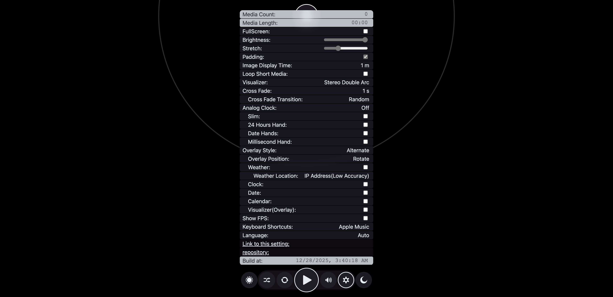
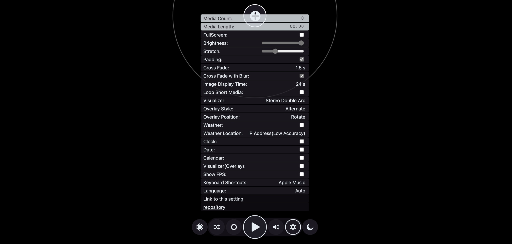
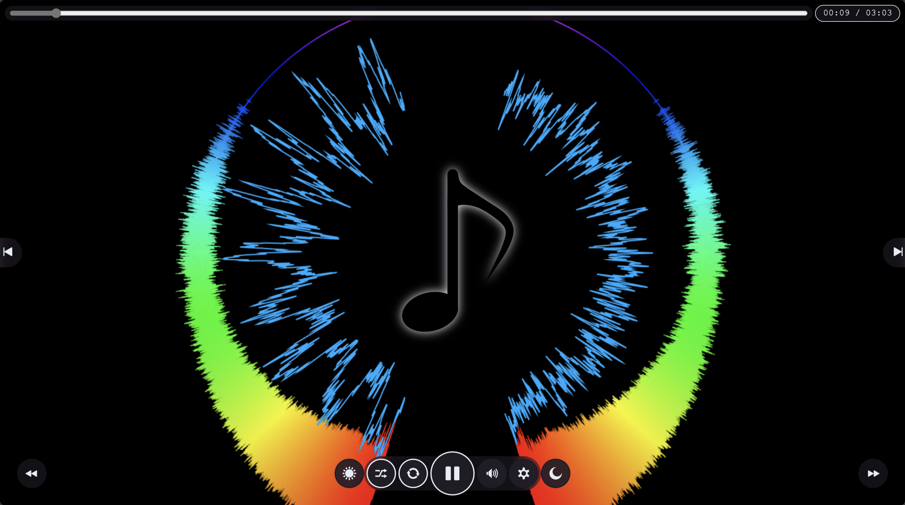
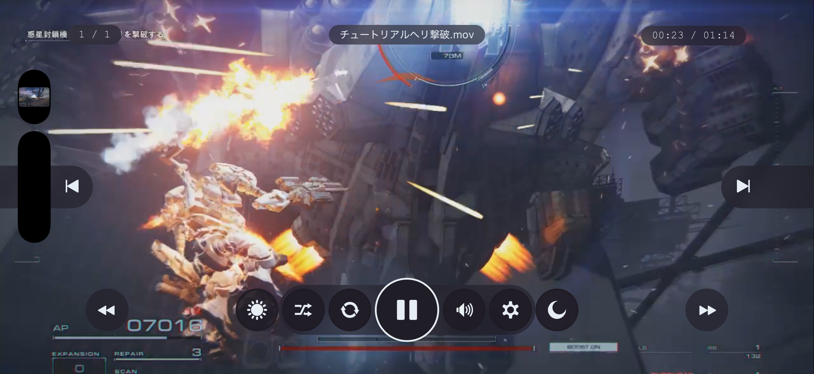
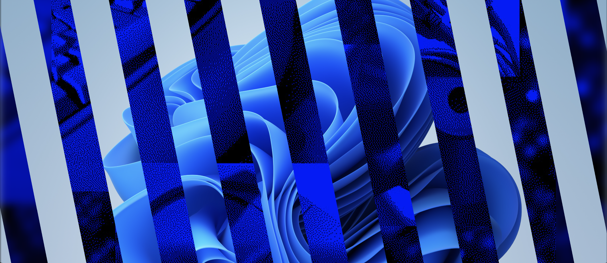
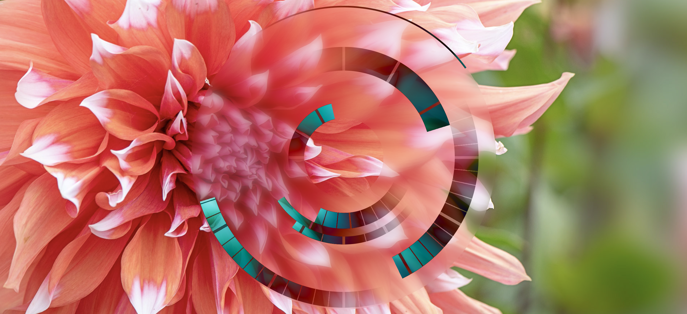
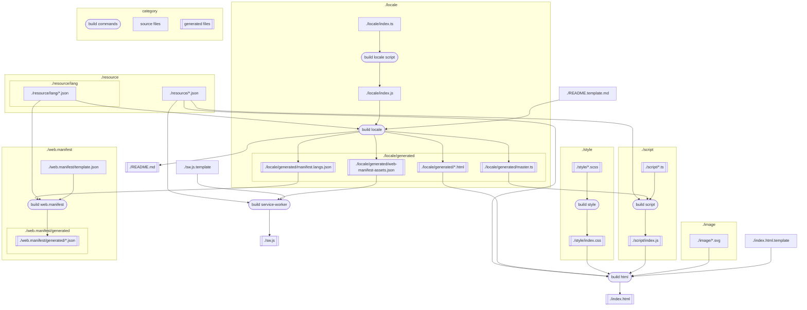

# Web Media Player

▶️ live site: <https://wraith13.github.io/web-media-player/>

## Feature

- ✅ Supports image, audio, and video media that can be played in your web browser! (Supported media types depend entirely on your environment.)
- ✅ Because it's web-based, you can run multiple instances (multi-window support), use it on smartphones and tablets, and even install it as an app!
- 🚫 Because it's web-based, playlists cannot be saved. (Technically possible, but not practical, so it's not implemented.)
- 🚫 Because it's web-based, background playback and timers do not work reliably.
- ✅ Safe shuffle playback (prevents issues such as media that never gets played or a just-played item playing again immediately.)
- ✅ Stretch settings to control how much content can exceed the screen size, preventing excessive enlargement.
- ✅ Padding settings to fill extra space with enlarged content.
- ✅ Various visualizers based on volume, waveform, and frequency.
- ✅ Stylish analog clock display
- ✅ Crossfade transitions: Alpha, Blur, Wipe, Random
- ✅ Weather, clock, date, calendar, and visualizer can be overlaid.
- ✅ Keyboard shortcut style presets: Apple Music, YouTube, Spotify, Windows Media Player
- ✅ Generally, when small images (such as pixel art) are enlarged in a web browser, they become blurry, but this player displays them sharply using pixelated rendering.
- ✅ Full offline support for all features except weather display (weather requires an Internet connection)
- ✅ For practical browser compatibility, everything that doesn't need to be split into a separate file is embedded in index.html. This reduces requests and enables very fast loading, so the single index.html file provides nearly all functionality with minimal issues.
- ✅ Multi-language support: __LANG_LABEL_LIST__

## Screenshot

UI


Settings Panel


Playing an image with padding and overlays


Playing an audio


Playing a video on an iPhone Air (installed and running as a App)


Wipe transition


Stylish analog clock


## Options Available via URL Parameters

The following options cannot be set via the UI.

- `locale`: Specifies the locale. (Example: [`#locale=en-us`](https://wraith13.github.io/web-media-player/#locale=en-us))
- `title`: Text displayed in place of the time. (Example: [`#title=Hello!`](https://wraith13.github.io/web-media-player/#title=Hello!&with-clock=true&with-date=true&overlay-position=center))
- `subtitle`: Text displayed in place of the date. (Example: [`#subtitle=Have+a+nice+day!`](https://wraith13.github.io/web-media-player/#subtitle=Have+a+nice+day!&with-clock=true&with-date=true&overlay-position=center))
- `screenshot`: Specifies the screenshot mode. Accepts one of `favicon` or `twitter-card`. (Example: [`#screenshot=twitter-card`](https://wraith13.github.io/web-media-player/#screenshot=twitter-card))

## How to build

### Prerequisites

- Node.js (version 16 or higher recommended)
- npm (Node Package Manager)

### Steps

1. Install dependencies:
   ```sh
   npm install
   ```
2. Build the project:
   ```sh
   npm run-script "build all"
   ```

## Build commands


( You can see this diagram in VS code with [Markdown Preview Mermaid Support extension](https://marketplace.visualstudio.com/items?itemName=bierner.markdown-mermaid). )

- `npm run-script "build all"`
- `npm run-script "build locale script"`
- `npm run-script "build locale"`
- `npm run-script "build web.manifest"`
- `npm run-script "build service-worker"`
- `npm run-script "build style"`
- `npm run-script "build script"`
- `npm run-script "build html"`

## Files

|path|description|
|---|---|
|[`./README.md`](./README.md)|Generated file|
|[`./README.template.md`](./README.template.md)|README template|
|[`./build.json`](./build.json)|Build settings|
|[`./index.html`](./index.html)|Generated file for GitHub Pages deployment|
|[`./index.html.template`](./index.html.template)|HTML template|
|[`./resource/*.json`](./resource/)|JSON files for configuration or data|
|[`./style/*.scss`](./style/)|Style source files|
|[`./script/*.ts`](./script/)|Script source files|
|[`./image/*.*`](./image/)|Image files used in the project|

## Powered by

- [build.js](https://github.com/wraith13/build.js)
- [evil-commonjs](https://github.com/wraith13/evil-commonjs)
- [evil-timer.js](https://github.com/wraith13/evil-timer.js)
- [flounder.style.js](https://github.com/wraith13/flounder.style.js)
- [wttr.in](https://github.com/chubin/wttr.in)

## License

[Boost Software License](./LICENSE_1_0.txt)
