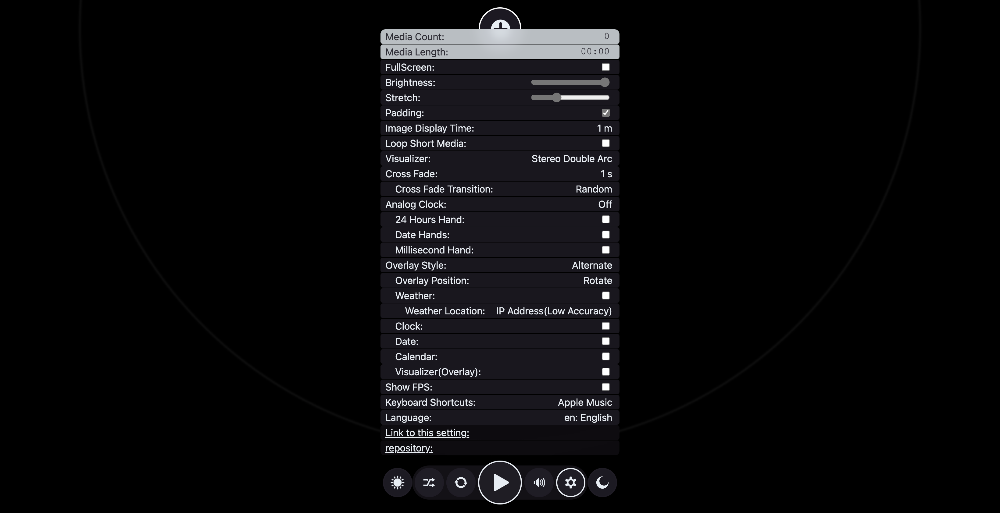

# Web Media Player

[](https://github.com/wraith13/web-media-player/actions/workflows/pages/pages-build-deployment)
[](./LICENSE_1_0.txt)

## ▶️ Live Site

<p align="center" style="padding:1rem;">
<a href="https://wraith13.github.io/web-media-player/">
<br/>
https://wraith13.github.io/web-media-player/
</a>
</p>

## 🎯 Feature

- ✅ Supports image, audio, and video media that can be played in your web browser! (Supported media types depend entirely on your environment.)
- ✅ Because it's web-based, you can run multiple instances (multi-window support), use it on smartphones and tablets, and even install it as an app!
- ✅ Safe shuffle playback (prevents issues such as media that never gets played or a just-played item playing again immediately.)
- ✅ Stretch settings to control how much content can exceed the screen size, preventing excessive enlargement.
- ✅ Padding settings to fill extra space with enlarged content.
- ✅ Various visualizers based on volume, waveform, and frequency.
- ✅ Stylish analog clock display ( ⚠️ This feature can be quite resource-intensive. )
- ✅ Crossfade transitions: Alpha, Blur, Wipe, Random
- ✅ Weather, clock, date, calendar, and visualizer can be overlaid.
- ✅ Keyboard shortcut style presets: Apple Music, YouTube, Spotify, Windows Media Player
- ✅ Generally, when small images (such as pixel art) are enlarged in a web browser, they become blurry, but this player displays them sharply using pixelated rendering.
- ✅ Full offline support for all features except weather display (weather requires an Internet connection)
- ✅ For practical browser compatibility, everything that doesn't need to be split into a separate file is embedded in index.html. This reduces requests and enables very fast loading, so the single index.html file provides nearly all functionality with minimal issues.
- ✅ FPS display
- ✅ Full keyboard navigation support
- ✅ Conforms to WAI-ARIA
- ✅ Multi-language support: __LANG_LABEL_LIST__
- 🚫 Because it's web-based, playlists cannot be saved. (Technically possible, but not practical, so it's not implemented.)
- 🚫 Because it's web-based, background playback and timers do not work reliably.

## 📷 Screenshot

UI


Settings Panel


Playing an image with padding and overlays


Playing an audio


Playing a video on an iPhone Air (installed and running as a App)


Wipe transition


Stylish analog clock ( ⚠️ This feature can be quite resource-intensive. )


## 🔗 Options Available via URL Parameters

The following options cannot be set via the UI.

- `locale`: Specifies the locale. (Example: [`#locale=en-us`](https://wraith13.github.io/web-media-player/#locale=en-us))
- `title`: Text displayed in place of the time. (Example: [`#title=Hello!`](https://wraith13.github.io/web-media-player/#title=Hello!&with-clock=true&with-date=true&overlay-position=center))
- `subtitle`: Text displayed in place of the date. (Example: [`#subtitle=Have+a+nice+day!`](https://wraith13.github.io/web-media-player/#subtitle=Have+a+nice+day!&with-clock=true&with-date=true&overlay-position=center))
- `screenshot`: Specifies the screenshot mode. Accepts one of `favicon` or `twitter-card`. (Example: [`#screenshot=twitter-card`](https://wraith13.github.io/web-media-player/#screenshot=twitter-card))

## 🛠️ How to build

### Prerequisites

- Git
- Node.js (version 16 or higher recommended)
- npm (Node Package Manager)

### Steps

1. Install dependencies:
   ```sh
   git submodule update --recursive --merge --init
   npm install
   ```
2. Build the project:
   ```sh
   npm run-script "build all"
   ```

More information: see [`./BUILD.md`](./BUILD.md#build-commands)

## 📁 Files

Detailed file reference: [FILES.md](./FILES.md)

- [Template files](./FILES.md#template-files)
- [Source files](./FILES.md#source-files)
- [Generated files (do not edit)](./FILES.md#generated-files-do-not-edit)
- [Runtime files](./FILES.md#runtime-files)
- [Other](./FILES.md#other)

## 🗣️ How to add a supported language

Create a JSON file for the language you want by copying one of the existing language JSON files in the [`./resouce/lang/`](./resouce/lang/) directory, then run the build. The Web Manifest, README.md, and other necessary files will be generated automatically and the language will be added.

## 🌐 How to publish

1. Fork [this repository](https://github.com/wraith13/web-media-player/) on GitHub.
2. Go `Settings`(→`Options`)→`GitHub Pages` or `Pages`, select `master` branch and `/(root)` folder from drop down list, and click `Save`.

## 💪 Powered by

- [build.js](https://github.com/wraith13/build.js)
- [evil-commonjs](https://github.com/wraith13/evil-commonjs)
- [evil-timer.js](https://github.com/wraith13/evil-timer.js)
- [flounder.style.js](https://github.com/wraith13/flounder.style.js)
- [wttr.in](https://github.com/chubin/wttr.in)

## ⚖️ License

[Boost Software License](./LICENSE_1_0.txt)
